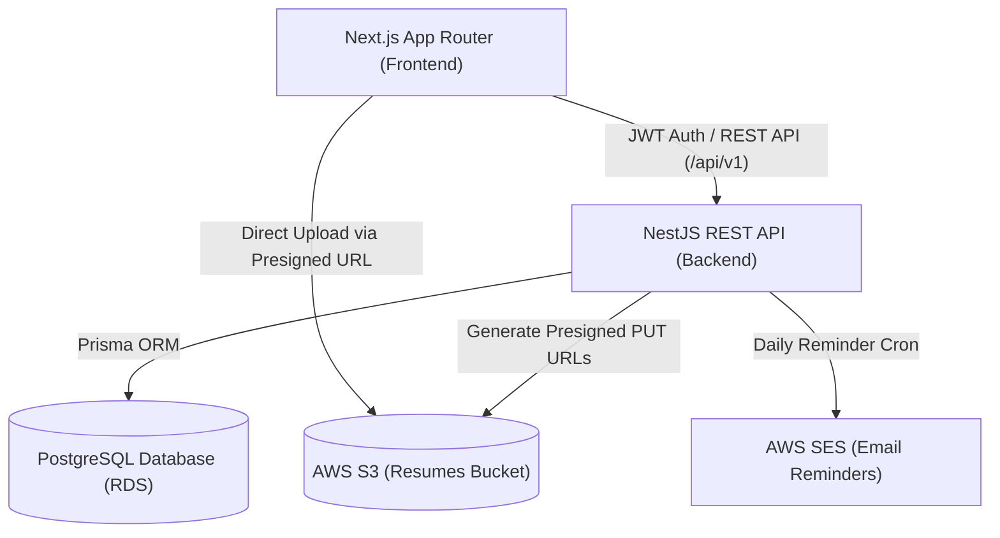

# Implementation Plan: Full-Stack Job Application Tracker

A production-grade, portfolio-ready Job Application Tracker web application with Next.js (App Router), NestJS, PostgreSQL (Flyway + Prisma), AWS S3/SES, AWS CDK (TypeScript), Docker multi-stage builds, and GitHub Actions CI/CD.

## User Review Required

> [!IMPORTANT]
> - **Flyway & Prisma Workflow**: Flyway (`db/migrations/V1__init.sql`) is the authoritative source of truth for the database schema. Prisma will be configured to match the exact Flyway DDL with standard `prisma generate` to provide type-safe queries.
> - **Local Development Experience**: To allow running both with and without active AWS credentials locally, the S3 and SES services in NestJS will support local mock/fallback storage or standard AWS Presigned URL generation based on environment variables.
> - **Design Aesthetics**: The frontend will feature a sleek, modern UI with dark mode, glassmorphic cards, polished micro-interactions, responsive Kanban board (`@dnd-kit`), and real-time status transitions.

---

## Architecture Overview

---

## Proposed Changes

### Phase 1: Database Layer & Migrations (`db/` and `backend/prisma/`)
- Setup Flyway migration `db/migrations/V1__init.sql` matching PostgreSQL DDL:
  - `users`, `resumes`, `applications`, `interviews`, `notes` tables with indexes and `application_status` ENUM.
- Setup `backend/prisma/schema.prisma` mapping precisely to the Flyway tables and enums.

#### [NEW] [db/migrations/V1__init.sql](file:///c:/Users/Sithu/Videos/4th%20Semester/Software%20Project/JobTracker/db/migrations/V1__init.sql)
#### [NEW] [db/flyway.conf](file:///c:/Users/Sithu/Videos/4th%20Semester/Software%20Project/JobTracker/db/flyway.conf)
#### [NEW] [backend/prisma/schema.prisma](file:///c:/Users/Sithu/Videos/4th%20Semester/Software%20Project/JobTracker/backend/prisma/schema.prisma)

---

### Phase 2: NestJS Backend (`backend/`)
- Setup NestJS application with TypeScript, validation pipes, global prefix `/api/v1`, and error handling.
- **Core Modules**:
  - `PrismaModule`: `PrismaService` connection lifecycle.
  - `AuthModule`: Register, Login, Refresh, Logout, `JwtStrategy`, `JwtAuthGuard`, `@CurrentUser()` decorator, bcrypt password hashing.
  - `UsersModule`: User retrieval and profile management.
  - `ApplicationsModule`: CRUD for applications scoped by `user_id`, status transitions, filtering by status.
  - `ResumesModule`: Presigned S3 PUT URL generation, upload confirmation, resume listing, and deletion.
  - `InterviewsModule`: Interview round scheduling, updating outcome/notes, deletion.
  - `NotesModule`: Application notes management.
  - `NotificationsModule`: Daily reminder cron job checking stale applications and dispatching emails via AWS SES.
- **Testing**:
  - Unit tests for services (`applications.service.spec.ts`, `auth.service.spec.ts`, `resumes.service.spec.ts`).
  - E2E tests (`applications.e2e-spec.ts`, `auth.e2e-spec.ts`).

#### [NEW] [backend/src/main.ts](file:///c:/Users/Sithu/Videos/4th%20Semester/Software%20Project/JobTracker/backend/src/main.ts)
#### [NEW] [backend/src/app.module.ts](file:///c:/Users/Sithu/Videos/4th%20Semester/Software%20Project/JobTracker/backend/src/app.module.ts)
#### [NEW] [backend/src/auth/*](file:///c:/Users/Sithu/Videos/4th%20Semester/Software%20Project/JobTracker/backend/src/auth)
#### [NEW] [backend/src/applications/*](file:///c:/Users/Sithu/Videos/4th%20Semester/Software%20Project/JobTracker/backend/src/applications)
#### [NEW] [backend/src/resumes/*](file:///c:/Users/Sithu/Videos/4th%20Semester/Software%20Project/JobTracker/backend/src/resumes)
#### [NEW] [backend/src/interviews/*](file:///c:/Users/Sithu/Videos/4th%20Semester/Software%20Project/JobTracker/backend/src/interviews)
#### [NEW] [backend/src/notes/*](file:///c:/Users/Sithu/Videos/4th%20Semester/Software%20Project/JobTracker/backend/src/notes)
#### [NEW] [backend/src/notifications/*](file:///c:/Users/Sithu/Videos/4th%20Semester/Software%20Project/JobTracker/backend/src/notifications)
#### [NEW] [backend/Dockerfile](file:///c:/Users/Sithu/Videos/4th%20Semester/Software%20Project/JobTracker/backend/Dockerfile)

---

### Phase 3: Next.js Frontend (`frontend/`)
- Setup Next.js (App Router, TypeScript, Tailwind CSS, Lucide icons, `@dnd-kit/core`).
- **Design System & UI**:
  - Dark/Light modern theme with glassmorphism, vibrant accents, smooth transitions.
  - Reusable UI primitives: Buttons, Modals, Badges, Tooltips, Tabs, Dropdowns.
- **Pages & Components**:
  - `/login` & `/register`: Clean auth screens with token persistence.
  - `/board`: Interactive Kanban board with 5 status columns (`Applied`, `Interview`, `Offer`, `Rejected`, `Withdrawn`). Optimistic drag-and-drop state updates with error rollback.
  - `NewApplicationModal`: Quick-create modal with company, role, date, salary/url, and resume selector.
  - `/applications/[id]`: Detailed view containing interview timeline, round manager, notes thread, and linked resume details.
  - `/resumes`: Resume version vault with drag-and-drop upload, version labeling, and download/preview links.
  - `/analytics`: Conversion funnel, response times, weekly velocity chart, and filtering.
- **API Client**:
  - `lib/api-client.ts`: Typed fetch wrapper handling automatic JWT token attachment and refresh flow.

#### [NEW] [frontend/app/layout.tsx](file:///c:/Users/Sithu/Videos/4th%20Semester/Software%20Project/JobTracker/frontend/app/layout.tsx)
#### [NEW] [frontend/app/page.tsx](file:///c:/Users/Sithu/Videos/4th%20Semester/Software%20Project/JobTracker/frontend/app/page.tsx)
#### [NEW] [frontend/app/login/page.tsx](file:///c:/Users/Sithu/Videos/4th%20Semester/Software%20Project/JobTracker/frontend/app/login/page.tsx)
#### [NEW] [frontend/app/register/page.tsx](file:///c:/Users/Sithu/Videos/4th%20Semester/Software%20Project/JobTracker/frontend/app/register/page.tsx)
#### [NEW] [frontend/app/board/page.tsx](file:///c:/Users/Sithu/Videos/4th%20Semester/Software%20Project/JobTracker/frontend/app/board/page.tsx)
#### [NEW] [frontend/app/applications/[id]/page.tsx](file:///c:/Users/Sithu/Videos/4th%20Semester/Software%20Project/JobTracker/frontend/app/applications/[id]/page.tsx)
#### [NEW] [frontend/app/resumes/page.tsx](file:///c:/Users/Sithu/Videos/4th%20Semester/Software%20Project/JobTracker/frontend/app/resumes/page.tsx)
#### [NEW] [frontend/app/analytics/page.tsx](file:///c:/Users/Sithu/Videos/4th%20Semester/Software%20Project/JobTracker/frontend/app/analytics/page.tsx)
#### [NEW] [frontend/Dockerfile](file:///c:/Users/Sithu/Videos/4th%20Semester/Software%20Project/JobTracker/frontend/Dockerfile)

---

### Phase 4: AWS CDK Infrastructure as Code (`infra/`)
- Setup modular AWS CDK TypeScript project:
  - `NetworkStack`: VPC (2 AZs, public & private subnets, NAT Gateway).
  - `DatabaseStack`: RDS PostgreSQL (`db.t4g.micro`), automated backups, security group ingress from ECS.
  - `StorageStack`: Private S3 bucket for resumes with CORS configuration for direct PUT uploads, SES domain/identity setup.
  - `ComputeStack`: ECS Fargate service behind an Application Load Balancer, ECR repository, Secrets Manager integration for database credentials and JWT secrets.

#### [NEW] [infra/bin/infra.ts](file:///c:/Users/Sithu/Videos/4th%20Semester/Software%20Project/JobTracker/infra/bin/infra.ts)
#### [NEW] [infra/lib/network-stack.ts](file:///c:/Users/Sithu/Videos/4th%20Semester/Software%20Project/JobTracker/infra/lib/network-stack.ts)
#### [NEW] [infra/lib/database-stack.ts](file:///c:/Users/Sithu/Videos/4th%20Semester/Software%20Project/JobTracker/infra/lib/database-stack.ts)
#### [NEW] [infra/lib/storage-stack.ts](file:///c:/Users/Sithu/Videos/4th%20Semester/Software%20Project/JobTracker/infra/lib/storage-stack.ts)
#### [NEW] [infra/lib/compute-stack.ts](file:///c:/Users/Sithu/Videos/4th%20Semester/Software%20Project/JobTracker/infra/lib/compute-stack.ts)

---

### Phase 5: Containerization & CI/CD (`docker-compose.yml`, `.github/workflows/`)
- Multi-stage Dockerfiles for Backend (`builder` -> `runner` non-root) and Frontend (`builder` -> `runner`).
- `docker-compose.yml` orchestrating PostgreSQL, Flyway migration runner, NestJS backend, and Next.js frontend.
- GitHub Actions CI/CD workflow (`.github/workflows/ci-cd.yml`):
  - PR checks: Lint, TypeScript check, unit & e2e tests.
  - Main deployment: DB migration test, Docker build & tag, ECR push, ECS task definition update, production Flyway migration execution.
- Comprehensive `README.md` with system architecture diagrams and setup walkthrough.

#### [NEW] [docker-compose.yml](file:///c:/Users/Sithu/Videos/4th%20Semester/Software%20Project/JobTracker/docker-compose.yml)
#### [NEW] [.github/workflows/ci-cd.yml](file:///c:/Users/Sithu/Videos/4th%20Semester/Software%20Project/JobTracker/.github/workflows/ci-cd.yml)
#### [NEW] [README.md](file:///c:/Users/Sithu/Videos/4th%20Semester/Software%20Project/JobTracker/README.md)

---

## Verification Plan

### Automated Tests
1. **Backend Unit Tests**:
   - `npm run test` in `backend/` verifying auth, applications, and resumes services.
2. **Backend E2E Tests**:
   - `npm run test:e2e` in `backend/` verifying auth registration/login and application lifecycle.
3. **Frontend Build Verification**:
   - `npm run build` in `frontend/` to confirm zero TypeScript and Next.js build errors.
4. **Infra Synth**:
   - `npx cdk synth` in `infra/` to validate CloudFormation templates.

### Manual Verification
1. Start PostgreSQL, Backend, and Frontend.
2. Register a new user, log in, receive JWT tokens.
3. Create new job applications, drag and drop across Kanban columns (`Applied` -> `Interview` -> `Offer`), verify status persists on refresh.
4. Add interview rounds and notes to an application and verify timeline display.
5. Upload a resume version, verify presigned S3 URL generation and upload confirmation.
6. Open browser subagent to verify visual appearance, responsive layout, and interactive features.
